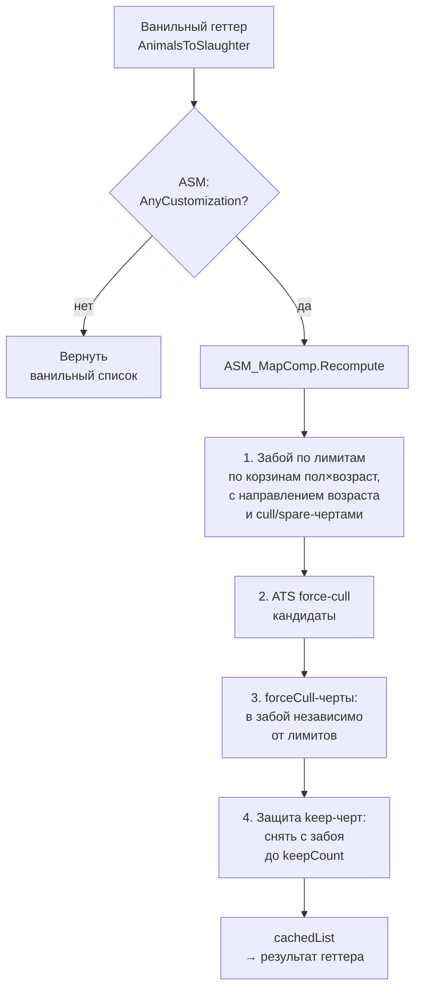
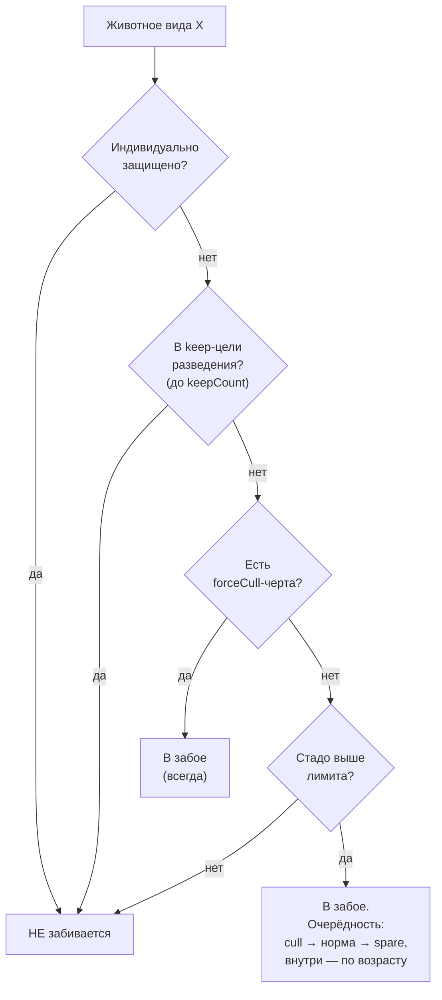

# Animal Slaughter Manager

Мод для **RimWorld 1.6** (`namespace ASM`, на Harmony), расширяющий ванильный авто-забой животных: приоритет по полу×возрасту, черты для разведения (защита), приоритетные/неприоритетные черты забоя, принудительный забой независимо от лимитов, защита конкретных животных, пресеты трёх уровней, таблица-менеджер и интеграция с Animal Traits System. Файлы мода — в папке `src/` (`About`, `Assemblies`, `Languages`, `Source`). Сборка и использование описаны ниже и в `AGENTS.md`.

---

## Сборка

Мод — SDK-style `.csproj`, `net472` (RimWorld 1.6 = Unity 2022.3 / Mono). API подключается через NuGet **`Krafs.Rimworld.Ref` 1.6.*`** (reference-only — игра для сборки не нужна) и **`Lib.Harmony`** (только компиляция; сама библиотека уже в игре).

```bash
dotnet build src/Source/AnimalSlaughterManager/AnimalSlaughterManager.csproj -c Release     # DLL → src/Assemblies/
```

Собранные DLL коммитятся (в `.gitignore` исключены только `bin/`, `obj/`, `*.pdb`, `*.xml` из `Assemblies/`). **Перед коммитом — собрать.**

RimWorld на машине разработчика может быть не установлен — компиляция против `Krafs.Rimworld.Ref` достаточна для проверки сборки. Поведение проверяется в игре (лог: `Ctrl+L` → `Player.log`).

---

## Возможности

Расширяет ванильный авто-забой. Поверх ванильных лимитов добавляются:

- **Приоритет по полу×возраст** — для каждой из 4 корзин (взрослые/молодые × самцы/самки) выбор «сначала старших» или «сначала молодых».
- **Четыре уровня черт** (требуется Animal Traits System, см. ниже):
  - `keepTraits` — **разведение/защита**: оставить N животных с чертой (с фильтрами возраст/пол/наследуемость), защитить от забоя.
  - `forceCullTraits` — **принудительный забой**: забивать животных с этой чертой всегда, независимо от количества и других настроек (кроме защиты).
  - `cullTraits` — **приоритетные для забоя**: забивать первыми при превышении лимитов.
  - `spareTraits` — **неприоритетные для забоя**: забивать последними.
- **Защита конкретных животных** (индивидуально, через гизмо на животном).
- **Пресеты трёх уровней** — экспорт/импорт между играми, с датой создания и фильтром:
  - **Все животные** — полные настройки всех видов;
  - **Для вида** — полные настройки одного вида (настроить у одного вида, загрузить другому);
  - **Список** — один список черт (keep/cull/spare/forceCull) одного вида.
  Пресеты верхних уровней можно применить к узкой цели (только её часть): пресет «все животные» — к виду или списку, пресет «вида» — к списку. Это всегда подсвечено меткой и тултипом. Удалять пресеты верхних уровней из окна нижнего уровня нельзя.
- **Таблица-менеджер** в стиле ванильного окна забоя (∞-лимиты, текущее/порог, серые нули у отсутствующих видов, иконки животных, три индикатора наличия настроек).

## Процесс забоя

Ванильный авто-забой работает через свойство `AutoSlaughterManager.AnimalsToSlaughter` — геттер, который каждый раз пересчитывает список. Мод патчит этот геттер (Harmony Postfix): если у нас есть какие-то настройки (`AnyCustomization`), результат геттера **заменяется** на наш пересчёт `ASM_MapComp.Recompute`. Иначе — ванильный результат без изменений.



**Порядок применения критичен** — он задаёт приоритет «кто кого перекрывает»:



> Итоговый приоритет перекрытий: **индивидуальная защита = keep-черты > forceCull > лимиты > cull/spare-очерёдность**. Защита выигрывает при пересечениях с принудительным забоем.

### Индикаторы настроек у вида (в таблице-менеджере)
Эксклюзивные (показывается один): `★` (зелёный) — защита (keep-черты); `▼` (красный) — принудительный забой (forceCull); `◆` (голубой) — приоритеты (пол×возраст или cull/spare). Индивидуальная защита индикатор **не** вызывает (у неё своя колонка). При наведении — тултип со списком всех присутствующих категорий.

## Интеграция с Animal Traits System (ATS)

ATS (`packageId = luved.animaltraits`) хранит черты как `HediffDef` с `defName` вида `AnimalTrait_*` на `pawn.health.hediffSet`. Мод обращается к ним **без жёсткой зависимости** (по имени типа/префиксу), поэтому компилируется и работает и без ATS. ATS сам патчит авто-забой, поэтому мод **компонуется**: spare уважается, cull воспроизводится, защита применяется последней.

> Совместимость: мод показывает черты из ATS и **совместимых** модов-расширений (например ATS Extended), если они добавляют черты как `AnimalTrait_*` HediffDef со стандартными `statOffsets`/`statFactors`/`capMods` (мод читает все стадии). Черты на других системах (гены Biotech, кастомные расширения) не определяются — чтобы отличать «черты» от болезней и прочих hediff’ов.

## Файлы

> Пути ниже указаны относительно папки мода (`src/`).

### Определения и переводы
| Файл | Зачем нужен / что делает |
|---|---|
| `About/About.xml` | Метаданные мода. |
| `Languages/{English,Russian}/Keyed/ASM.xml` | Все переводные строки (включая переиспользуемые ванильные ключи окна забоя с опечаткой `AutoSlaugther...`). |

### Модели и enums (`Source/AnimalSlaughterManager/src/Data/`)
| Файл | Зачем нужен / что делает |
|---|---|
| `SlaughterPreference.cs` | Enum: `OldestFirst` / `YoungestFirst` — направление забоя по возрасту в корзине. |
| `AgeScope.cs` | Enum-фильтр возраста для черт: `Both` / `Adult` / `Young`. |
| `GenderScope.cs` | Enum-фильтр пола для черт: `Any` / `Male` / `Female`. |
| `InheritableFilter.cs` | Enum-фильтр наследуемости черты: `Both` / `Inheritable` / `NonInheritable`. |
| `TraitTarget.cs` | Цель разведения (`keep`): черта + `keepCount` + скоупы возраст/пол/наследуемость. `IExposable`. |
| `CullTrait.cs` | Черта забоя (`cull`/`spare`/`forceCull`): черта + скоупы возраст/пол/наследуемость. `IExposable`. |
| `KindSettings.cs` | Все настройки одного вида: 4 `SlaughterPreference` + списки `keepTraits`/`cullTraits`/`spareTraits`/`forceCullTraits`. Флаги `Customized`/`HasPrioritySettings`/`HasProtectionSettings`/`HasForceCullSettings`. `IExposable` (сохраняется в сейв). |

### Компоненты (`Source/AnimalSlaughterManager/src/Comps/`)
| Файл | Зачем нужен / что делает |
|---|---|
| `ASM_MapComp.cs` | `MapComponent` — хранилище состояния: `kindSettings` (настройки по видам), `protectedPawnIDs` (индивидуальная защита), кэш списка забоя. Главный метод `Recompute(AutoSlaughterManager)` — полный пересчёт (см. диаграмму выше). Счётчики `CountKeptByTraits`/`CountIndividuallyProtected`. |
| `AnimalTraitsAccess.cs` | Стабильный мост к ATS без жёсткой ссылки: определение черт (`AnimalTrait_*`, исключая `Common` и `StatReference`), `HasTrait`, `IsInheritable`, цвет/тултип черты (читает **все стадии** statOffsets/statFactors/capMods), `FormatStatFactor`, cull-список ATS. |
| `PresetIO.cs` | Экспорт/импорт пресетов трёх уровней (`All`/`Kind`/`List`) в подпапках `<persistentDataPath>/AnimalSlaughterManagerPresets/` (`All/`, `Kind/`, `List/<список>/`; legacy-пресеты в корне читаются как `All`) через `XmlSerializer`. DTO с defName (живёт между играми). Сериализует все 4 уровня черт + наследуемость. Поддерживает применение пресета верхнего уровня к узкой цели (только её часть) и защиту от удаления пресетов верхних уровней из окон нижних. |

### Патчи Harmony (`Source/AnimalSlaughterManager/src/Patches/`)
| Файл | Зачем нужен / что делает |
|---|---|
| `HarmonyInit.cs` | `[StaticConstructorOnStartup]` — `new Harmony(id).PatchAll()`. Точка входа патчей. |
| `Patch_AutoSlaughter.cs` | Postfix на геттер `AnimalsToSlaughter`: при `AnyCustomization` заменяет результат на `Recompute`, иначе no-op. |
| `Patch_Notify.cs` | Postfix’ы на `Notify_*` авто-забоя: сбрасывают кэш (`dirty = true`), чтобы список вовремя обновлялся. |
| `Patch_AnimalsTab.cs` | Postfix на вкладку «Животные»: добавляет кнопку «Менеджер забоя» рядом с ванильной кнопкой авто-забоя. |
| `Patch_PawnGizmos.cs` | Добавляет гизмо «Настройки забоя» и «Защитить от забоя» **на животных** (гейт `RaceProps.Animal` + `CanEverAutoSlaughter` — обязательно `Animal`, иначе появится у людей). |

### Окна (`Source/AnimalSlaughterManager/src/Windows/`)
| Файл | Зачем нужен / что делает |
|---|---|
| `Dialog_SlaughterManager.cs` | Таблица-менеджер всех видов: иконки, «Сейчас»/«Порог» (∞-кнопки, поля на 3 цифры, красное при превышении, серые нули у отсутствующих), тогглы «Беременные»/«С привязанностью» (paint-заливка по строкам), колонки защиты, кнопка «Настроить», три индикатора настроек + тултип. |
| `Dialog_KindSlaughterSettings.cs` | Настройки одного вида, **2 таба**: «Приоритеты» (4 корзины пол×возраст + секции cull/spare) и «Особые правила» (keep-разведение + forceCull-принудительный забой). В шапке справа от названия вида — кнопка «Пресеты для вида» и две кнопки сброса (сбросить вкладку / сбросить все вкладки). В каждой секции справа от заголовка — кнопка очистки всего списка, кнопка добавления черты (один текст у всех секций) и одна кнопка «Пресеты списка» (и сохраняет, и загружает). Во всех секциях — колонка наследуемости (возраст/пол/наследуемость), drag-перестановка строк, копирование, красный крестик удаления, заголовки выводятся полностью без сокращений. Блоки разделены линиями (в т.ч. между приоритетами и секцией spare). Списки черт занимают всю оставшуюся высоту (минимум 150px). Окно не перетаскивается целиком — двигается рамкой и полосой заголовка/табов, поэтому реордер строк работает во всех секциях. |
| `Dialog_TraitPicker.cs` | Выбор черт: сверху — поиск по имени черты (лупа + поле до середины + ✕ сброса), далее сортируемая таблица статов (по всем стадиям), двухрядный заголовок (клик по имени = сортировка, ручка `↔` = перенос колонки, ✕ = скрыть), multi-select с drag-paint по строкам. Окно двигается снаружи таблицы. |
| `Dialog_PresetBrowser.cs` | Единый менеджер пресетов трёх уровней (`All`/`Kind`/`List`): сохранение/загрузка/**перезапись**/удаление (с подтверждением). Сверху — строка поиска (значок лупы + поле до середины + ✕ очистки сразу после поля, а справа — переключатели фильтра по типу пресета `[Все виды]`/`[Вид]`/`[Список]`), одним отступом под заголовком; снизу — строка сохранения (поле имени + «Сохранить»; дисейблится, если сохранять нечего или не введено имя). Список: зебра-фон, отступы строк сверху и по бокам, дата создания мелким шрифтом (в одну строку), сортировка по дате (новые сверху), фильтр по имени и типу, применение пресетов верхних уровней к узкой цели (метка `[Все виды]`/`[Вид]` + тултип), кнопка загрузки + кнопка перезаписи (same-scope) + иконка-мусорный бак удаления справа; колонки выровнены, запрет удаления пресетов верхних уровней. (`Dialog_Presets.cs` — пустой стаб.) |

---

Подробная справка по архитектуре, проверенному RimWorld 1.6 API и граблям — в [`AGENTS.md`](AGENTS.md).
